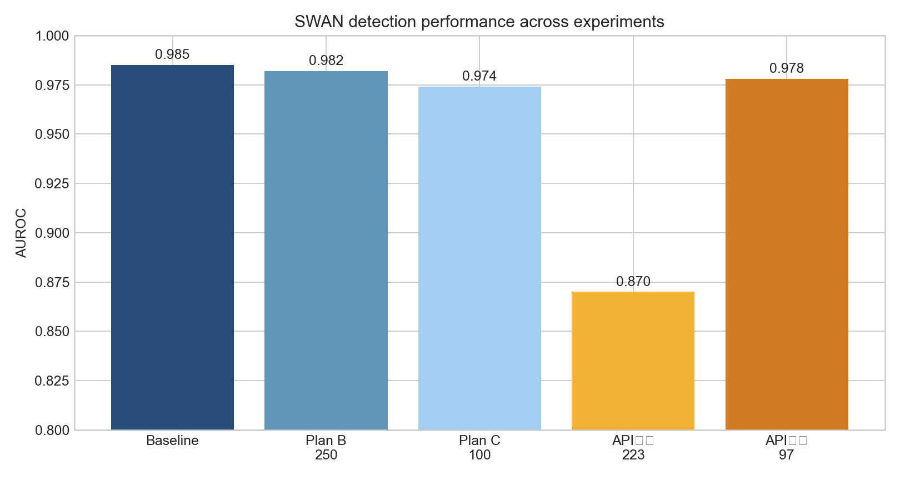
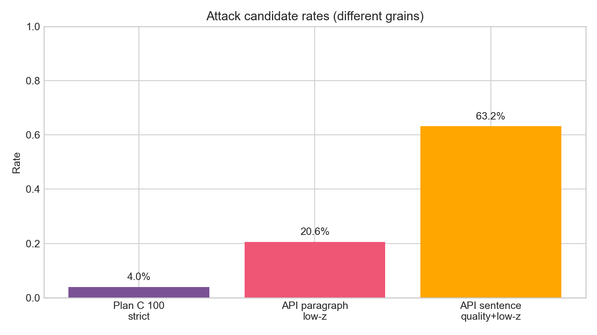

# AMR-SWAN 攻击实验结果汇报

## 一、结论摘要

本项目比较了 AMR 节点/边/子图攻击、reentrancy 攻击，以及 DeepSeek 句法改写攻击。最强的句子级结果来自 API 句法改写，但嵌回完整段落后效果明显减弱。当前证据支持“局部可影响、整体难绕过”，不支持“已经稳定破解 SWAN”。

## 二、核心结果

| 实验 | 样本粒度 | 样本数 | 平均 z | 低于 z≤2.33 | AUROC | 说明 |
|---|---|---:|---:|---:|---:|---|
| 原始 SWAN 基线 | 段落 | 250 | — | — | 0.985 | TPR@1%=0.892，TPR@5%=0.944 |
| Plan B 组合攻击 | 段落 | 250 | 3.148 | 20.0% | 0.982 | AMR 节点+子图 |
| Plan C 组合强算子 | 段落 | 100 | 3.086 | 23.0% | 0.974 | modifier+argument |
| API 句法改写 | 句子 | 223 | 0.882 | 99.6% | 0.870 | 质量通过 142/223 |
| API 改写嵌回段落 | 段落 | 97 | 3.025 | 20.6% | 0.978 | 质量通过句子嵌回 |

## 三、如何理解“有效”

有效攻击必须同时满足：检测分数下降、文本语义基本保持、实体/数字/否定/事件关系不被破坏、文本自然可读。仅 z-score 下降而文本损坏，只能算失败案例。

97 个段落来自 250 个原始段落：223 个自然句子中，142 个通过自动质量规则，分布在 97 个原始段落。段落级低检测率为 20.6%，bootstrap 95% CI 为 12.4%–28.9%。

## 四、主要发现

1. AMR 局部节点、边、modifier、argument 和 reentrancy 操作只能带来有限整体收益。
2. DeepSeek 非思考模式句法改写在句子级显著降低检测分数。
3. 改写嵌回完整段落后，SWAN 的整体 AUROC 仍为 0.978，检测器依然稳健。
4. 主要瓶颈是段落级统计聚合、AMR 重解析恢复和语义质量约束。

## 五、当前论文结论

建议表述为：AMR 图结构和句法改写能够在局部样本上降低 SWAN 检测分数，但尚未实现稳定的段落级水印绕过。该结果支持对 AMR 语义水印鲁棒性、攻击失败模式和句子级/段落级差异进行系统研究。

## 六、数据与复现

所有原始实验目录保留在 `experiments/`；历史数据归档于 `experiments/archive_20260725/`。API 密钥未写入报告、图表或归档。
