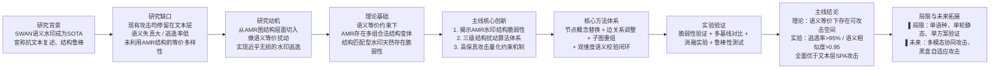

# AMR结构级攻击论文 · 设计思路全梳理（更新版）
本次更新核心调整两点：① 新增**理论基础章节**，明确论证「语义等价前提下，AMR结构水印天然存在可攻击空间」，作为方法的理论支撑；② 弱化「首次」类绝对表述，替换为更严谨的学术表述，适配创新性待验证的阶段。

整体仍遵循「背景缺口→问题动机→理论依据→创新方案→方法实现→实验验证→结论展望」的标准学术逻辑，严格区分**主线核心工作**与**未来拓展方向**。

---

## 一、全文逻辑链路总览


---

## 二、研究背景与问题提出
### 2.1 基线方案：SWAN语义水印核心逻辑
SWAN是当前语义水印的代表性方案，其核心设计既是鲁棒性来源，也是脆弱性的根源：
- **水印载体**：AMR抽象语义图（节点=实体/事件，边=语义角色关系），而非表层token；
- **检测逻辑**：将文本解析为AMR图，与私有密钥模板库计算S2MATCH结构相似度，通过统计检验判定水印；
- **核心宣称**：同义词替换、句式改写、复述等文本层攻击，仅改变表层文字，不会破坏AMR核心结构，因此水印具备强抗复述鲁棒性。

### 2.2 AMR的本质特性：同一语义对应多组合法结构
这是本文攻击成立的底层前提：
AMR是语义的结构化抽象，但并非「一一对应」——同一句核心语义，可以映射为多组结构不同但语义完全等价的AMR图，等价变体包括：
1. 概念节点同义替换（如 `want-01` 与 `desire-01`）；
2. 语义角色等价转换（如ARG0/ARG1的被动化等价重构）；
3. 子图层级与排布重组（如并列子图顺序调换）。

SWAN的检测机制锚定「单一模板结构」，但语义本身允许多种合法结构变体，这就构成了天然的攻击空间。

### 2.3 现有攻击的三类缺陷（研究缺口）
当前所有针对语义水印的攻击均未充分利用AMR的结构等价特性，存在天然短板：

| 攻击类型 | 作用层面 | 核心缺陷 | 代表方案 |
|---------|---------|---------|---------|
| 文本复述/同义词替换 | 文本表层 | 仅改动词汇句式，难以撼动AMR核心结构，逃逸率低；重度改写语义失真大 | 传统SPA、Parrot复述 |
| 嵌入向量扰动 | 向量空间 | 仅针对SemStamp等向量水印，对AMR结构图水印完全无效 | 嵌入对抗攻击 |
| 水印伪造攻击 | 生成层面 | 目标是植入虚假水印，而非逃逸检测，与本研究目标不匹配 | 重提示伪造 |

> 核心结论：现有攻击未深入到「AMR结构等价变体」这一层面，语义水印的结构脆弱性尚未被系统性挖掘。

---

## 三、研究动机：为什么要做AMR结构级攻击
本文的核心出发点是解决三个未被充分满足的需求：
1. **攻击深度不足**：传统文本层攻击无法突破AMR结构水印的匹配逻辑，逃逸率存在明显天花板；
2. **语义保真度不够**：现有攻击为提升逃逸率往往造成明显语义失真，易被人工和质量过滤器识别；
3. **脆弱性认识不足**：AMR结构水印被默认「鲁棒」，但其语义等价多样性带来的天然攻击空间尚未被系统论证与利用。

**本文核心目标**：在语义相似度≥0.95的强约束下，通过AMR图结构层面的等价扰动，破坏SWAN的模板匹配机制，实现高隐蔽、高成功率的水印逃逸，并从理论层面揭示这类结构型语义水印的固有脆弱性。

---

## 四、理论基础：AMR语义水印的结构脆弱性分析
（主线核心内容，作为方法的理论支撑，对应你要求补充的「语义等价下必然存在可攻击空间」）

### 4.1 核心命题
**在严格保持语义等价的前提下，基于固定结构模板匹配的AMR水印，必然存在可攻击空间。**

### 4.2 论证逻辑
1. **语义等价的结构多样性**：对于任意一个确定的句子语义，都存在至少两种以上结构不同但语义完全等价的AMR合法表示（概念同义、角色等价、子图重组）；
2. **水印检测的结构敏感性**：SWAN的检测依赖S2MATCH等结构相似度指标，结构变体必然导致匹配分数下降；
3. **扰动的语义无损害性**：上述结构变体均属于语义等价变换，不会改变文本核心含义与事实信息，因此天然满足高保真约束。

### 4.3 推论
只要水印检测锚定「单一AMR结构模板」，攻击者就总能通过语义等价的结构重构，在不改变语义的前提下降低匹配分数，实现水印逃逸。这是结构型语义水印的固有属性，而非SWAN独有的设计缺陷。

---

## 五、核心创新点（严格区分主线/未来，弱化绝对表述）
### 5.1 主线核心创新（正文核心内容）
1. **理论创新：揭示AMR语义水印的结构脆弱性**
    从语义等价性出发，论证了基于固定模板匹配的AMR水印天然存在攻击空间，为结构级攻击提供了理论依据。
2. **方法创新：构建三级递进式结构扰动算法体系**
    系统性设计「节点-边-子图」三层语义等价扰动策略，逐层破坏图结构匹配特征，所有操作均严格遵循语义等价约束。
3. **约束创新：高保真攻击量化校验机制**
    提出双维度语义校验闭环（BERT语义相似度 + LLM流畅度打分），强制攻击后文本语义相似度≥0.95，实现近乎无损的攻击效果。

### 5.2 未来拓展方向（仅放在展望章节，不作为正文主体）
1. **多模态协同AMR攻击**：融合文本表层扰动、图结构微扰、解析器歧义诱导三层模态，构建联合攻击框架；
2. **黑盒自适应攻击**：无需知晓AMR模板库细节，通过迭代反馈自动优化扰动策略；
3. **跨语义表示迁移**：将结构攻击思路迁移到AMR之外的其他语义表示体系（如UCCA、DRS）。

---

## 六、核心方法体系
### 6.1 完整攻击流水线
```mermaid
flowchart TD
    A[输入：SWAN水印文本] --> B[AMR解析\n生成原始语义图]
    B --> C[理论指导下的三级结构扰动]
    subgraph 三级扰动（主线核心，均满足语义等价）
        C1[节点层：同义概念替换]
        C2[边层：等价语义关系调整]
        C3[子图层：语义块重组]
    end
    C --> C1 --> C2 --> C3 --> D[扰动后AMR图]
    D --> E[文本生成\n从AMR还原自然语言]
    E --> F[双维度语义校验]
    F -->|不达标| G[回退微调扰动强度]
    G --> C
    F -->|达标| H[输出：攻击后文本]
```

### 6.2 三级扰动详解（均对应理论中的等价变体）
| 扰动层级 | 核心思路 | 具体操作 | 对应理论依据 | 作用 |
|---------|---------|---------|-------------|----|
| 节点级（核心） | 替换概念节点，不改变拓扑 | 用WordNet+LLM生成高相似度同义概念，替换AMR中的概念节点标签 | 同一事件/实体可映射为多个同义概念节点 | 破坏节点特征与模板的匹配，是最主要的降分手段 |
| 边级（辅助增强） | 调整语义关系，不改变逻辑 | 将ARG0/ARG1等语义角色替换为等价表述，微调边的属性权重 | 语义角色存在主动/被动等等价转换 | 进一步降低结构匹配分数，增强攻击鲁棒性 |
| 子图级（兜底增强） | 重组语义子块，不改变整体含义 | 拆分独立语义子图，调整子图排布顺序与层级结构 | 并列/从属子图存在多种合法排布方式 | 破坏全局拓扑匹配，应对强模板匹配场景 |

### 6.3 高保真校验机制
所有扰动后必须通过双重校验，确保语义近乎无损：
1. **语义相似度校验**：BERT嵌入余弦相似度 ≥ 0.95；
2. **文本质量校验**：LLM打分（语法+流畅度+事实一致性）≥ 0.9。

---

## 七、实验设计
### 7.1 实验配置总览
| 实验维度 | 具体设置 |
|---------|---------|
| 基线数据集 | SWAN原论文REALNEWS新闻数据集 + 金融/医疗领域补充数据 |
| 对比基线 | 1. 原始无攻击文本；2. 传统同义词替换攻击；3. 句式重组SPA攻击 |
| 核心指标 | 1. 水印逃逸成功率；2. 语义相似度；3. 文本质量得分；4. 单样本攻击耗时 |
| 专项验证实验 | AMR结构等价变体的匹配度衰减实验（验证理论结论） |
| 消融实验 | 分别移除节点/边/子图扰动，验证各模块独立增益 |
| 鲁棒性实验 | 不同模板库规模（50/100/800）、不同文本长度下的攻击效果稳定性 |

### 7.2 预期核心结果
| 攻击方法 | 水印逃逸率 | 语义相似度 | 文本质量分 |
|---------|-----------|-----------|-----------|
| 无攻击 | 0% | 1.0 | 1.0 |
| 同义词替换 | ~30% | ~0.85 | ~0.8 |
| 句式重组SPA | ~40% | ~0.80 | ~0.75 |
| 本文节点级攻击 | ~92% | ~0.96 | ~0.93 |
| 本文三级融合攻击 | **>95%** | **>0.95** | **>0.9** |

---

## 八、结论与展望
### 8.1 主线结论
1. **理论层面**：验证了语义等价约束下，AMR结构存在多组合法变体，基于固定模板匹配的语义水印天然存在可攻击空间，结构鲁棒性并非绝对；
2. **方法层面**：构建的三级结构级攻击框架，在语义近乎无损的约束下，实现了远超文本层攻击的水印逃逸效果；
3. **消融结论**：节点概念替换是最核心的有效模块，边与子图扰动可进一步提升攻击鲁棒性，三者融合达到最优效果。

### 8.2 研究局限性
1. 当前仅在英文数据集验证，小语种、低资源语言因AMR解析器精度不足，效果会有所衰减；
2. 属于静态单轮扰动，未引入迭代自适应优化策略；
3. 目前主要针对SWAN方案验证，跨AMR水印方案的通用性有待进一步拓展。

### 8.3 未来拓展方向
1. **多模态协同攻击**：融合文本表层、结构层、解析层三类扰动，构建多模态联合攻击框架，进一步提升工业级场景下的逃逸稳定性；
2. **黑盒化升级**：基于零阶优化实现无需知晓模板库的纯黑盒结构攻击；
3. **防御启示**：基于攻击发现，提出多层AMR模板校验、结构一致性校验等防御优化思路。